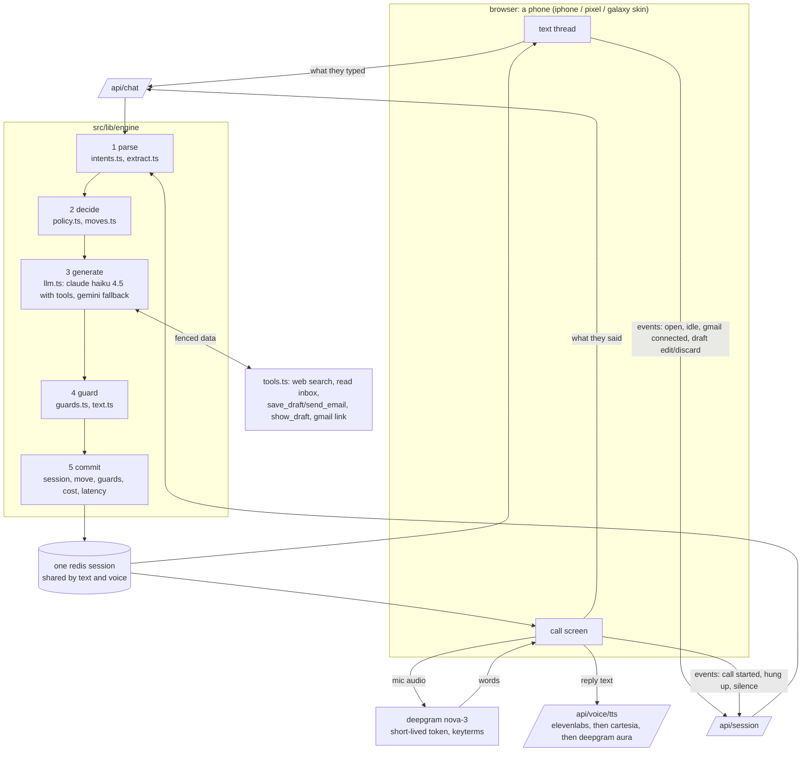

# architecture, on one page

*sept 28, 2026*

the whole design is one idea: the model talks, code decides. a prompt is a suggestion the model follows most of the time. anything that has to happen every time (a goodbye before a hangup, a text after every call, never sending an email nobody saw) lives in code, where a test can hold it in place.

## the picture

## what each step owns

| step | code or model | what it decides |
|---|---|---|
| parse | code, plus one small model pass | what they actually said: a name, a yes, a no, bye, "no calls", "skip this". only their own turn counts, so an old "bye" never hangs up a later call |
| decide | code | what's still missing, whether to offer a call, and one conversation move for the turn, each with its source (e.g. *the mom test*, *to sell is human*) |
| generate | model | the words, and which tools to use to actually help |
| guard | code | whether the reply is allowed to go out as written (the list below) |
| commit | code | saving the session, the move, the guards that fired, and the turn's cost and latency |

## the model layer

`src/lib/llm.ts` runs claude when `LLM_PROVIDER=anthropic` is set, which is how prod runs: `AGENT_MODEL` and `FAST_MODEL` are both `claude-haiku-4-5` there (the code default is `claude-sonnet-5` for the agent loop, env-overridable). with no provider set it falls back to gemini, walking a chain of free-tier models when one runs out of quota. the numbers in the README and `harness/ROUNDS.md` were measured on claude haiku 4.5, the same model prod runs. an optional `LLM_FALLBACK=anthropic` gives free-tier gemini a capped claude insurance policy when every gemini model is out of quota.

## the guards

the guards run as one ordered pipeline (`src/lib/engine/guards.ts`). every guard that changes a reply tags it, and the "examine reasoning" panel shows the tags as "checks that ran" chips. there are 33:

- **honesty:** dropped unsupported claim (including calendar access it doesn't have, and naming the model behind it), blocked a false 'sent' claim, blocked a false 'connected' claim, dropped a false 'link sent' claim, sent the link it said it sent, sent the link they said yes to before letting them go
- **leaks:** leak filtered (notes about the system), narration dropped (the user in the third person, the agent narrating its own plan), tool names stripped, blocked a line not allowed here
- **tone:** dropped an accusing line, dropped a guess stated as fact, name held back (used it just now)
- **not a form:** blocked repeat question, rewrote a repeat question, cut a double question, blocked a third question in a row, blocked repeat name question
- **gmail, asked well:** gmail ask written by code, gmail pitch held for its own turn, gmail demand softened, repeat gmail ask dropped
- **calls:** goodbye added before hangup, hung up after goodbye, yielded: they said stop, said out loud that the link is in texts, long text moved to the chat, contact card before the call, contact card resent in code
- **safety:** quarantined: came from an email, ignored: not user-said
- **fallbacks:** model failed: scripted line, empty reply: scripted line

## beyond the chip guards: the email tools' own checks

`save_draft` and `send_email` (`src/lib/engine/tools.ts`) enforce a few things the model is told about but that never show up as a "checks that ran" chip, because they change what the tool call is allowed to do rather than rewriting the reply text after the fact:

- a recipient has to be an address the user actually gave, or one seen in a real inbox item, never one the model made up
- a reply or follow-up (`follow_up: true`, or the user saying "follow up" / "reply" / "email him again") reuses the last recipient and the same gmail thread (`Re: <subject>`, `threadId` carried through), instead of starting a new one
- editing an email that's already sent doesn't quietly resend: `save_draft` and `send_email` both check `s.lastSent` and return a plain "this would be a second copy" warning that the model has to relay, not send around
- a named subject the user actually asked for is kept as given, not rewritten
- `show_draft` brings the last unsent draft back into view without letting the model retype it from memory

## when things fail

| failure | what happens |
|---|---|
| the model errors or times out | a scripted line goes out instead. a second failure on a call says so and hangs up, and the conversation carries on over text |
| the claude budget cap is hit (claude path only) | same as a model failure: scripted lines, never a silent chat |
| the claude spend cap is hit, or the model errors | a scripted line goes out instead of silence (the engine never waits on a reply that won't come); with no provider set, gemini walks its free-tier fallback chain first |
| they hang up mid-sentence | a recap text always follows, written by code if the model's is empty. a name or need they said but we missed gets caught after the hangup |
| silence on a call | quiet is fine for a long time: a check-in that picks up where you were after 25s (45s after "hold on"), a softer one 30s later, a heads-up at about two minutes, then a goodbye and a hangup 12s after that |
| left on read over text | at most one short double text, written by code, and never a third text in a row; before your first message, one gentle line after a minute; nothing right after a call's recap; and only when something's actually pending (an unanswered question, a call offer, a link) |
| a dead or muted mic | true digital silence is told apart from a quiet room, and a card offers another mic or switching to text (journal 16); no mic permission at all carries on over text |
| speech to text fails | the browser's own speech recognition takes over |
| text to speech fails or runs out of credits | the next provider in the chain (elevenlabs, then cartesia, then deepgram aura) takes over for 6 hours, so the voice doesn't flip mid-call |
| google blocks the sign-in (not a test user) | a demo inbox is one tap away in the popup, and offered once in the chat |
| an email tries to give instructions | it reaches the model fenced as data, is never an interruption, and anything only it said can't become a name, a need, or a recipient address |
| an email would be a duplicate send | the tool refuses to send silently and hands back a warning the model must relay, asking whether they still want it sent |
| two tabs, or a double send | turns on one session are serialized, and other tabs sync from the server |
| offline | the message waits and retries when the connection comes back |

## costs

measured by `pnpm metrics` over the last full harness run (claude haiku 4.5 as the agent, since that's what the harness graded against):

| | |
|---|---|
| per reply | $0.0030 |
| per onboarding | $0.0152 |
| post-hangup catch-up pass | about $0.001 per call, only when something is still missing |
| latency | p50 2.0s, p95 4.8s (turn time, a little high; new sessions record model latency) |

prod runs on claude haiku 4.5, about a third of a cent a reply, and checks a hard spend cap before every call. speech (deepgram) and voice (elevenlabs / cartesia) aren't metered here yet.

## what i'd change

- **a decide() reducer.** today the decision is spread across `policy.ts`, `moves.ts` and a few early returns in `turn.ts`. i'd make it one pure function, (session, parsed turn) to (next move, actions), so every decision is one unit test and the whole policy reads in one place.
- **real telephony.** the call is a browser simulation. persona calls real phones, so i'd move the voice loop to twilio media streams (or similar) with the same engine behind it. the engine already treats the call as events (started, silence, hung up), which is most of the work.
- **speculative replies for latency.** start generating while the person is still finishing their sentence, and throw it away if they keep going. p95 is where a call feels robotic, and this is where it would come down.
- **evals in CI.** the harness runs by hand and costs a little. i'd run a small fixed set of personas on every merge, with a claude grader and a pinned rubric, and fail the build when the score drops.
