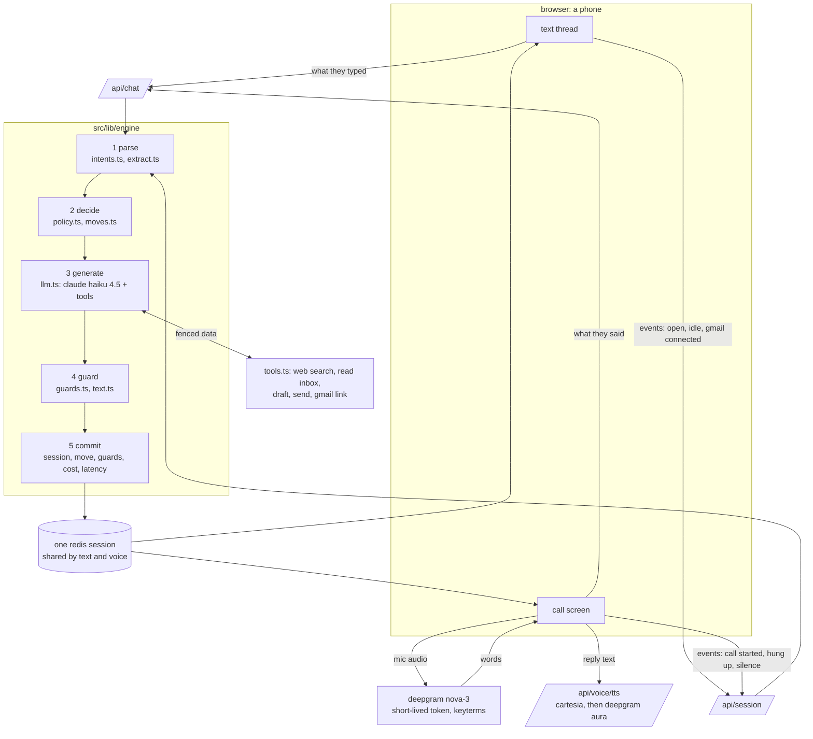

# architecture, on one page

*sept 28, 2026*

the whole design is one idea: the model talks, code decides. a prompt is a suggestion the model follows most of the time. anything that has to happen every time (a goodbye before a hangup, a text after every call, never sending an email nobody saw) lives in code, where a test can hold it in place.

## the picture

## what each step owns

| step | code or model | what it decides |
|---|---|---|
| parse | code, plus one small model pass | what they actually said: a name, a yes, a no, bye, "no calls", "skip this". only their own turn counts, so an old "bye" never hangs up a later call |
| decide | code | what's still missing, whether to offer a call, and one conversation move for the turn, each with its source (e.g. *the mom test*, *to sell is human*) |
| generate | model | the words, and which tools to use to actually help |
| guard | code | whether the reply is allowed to go out as written (the list below) |
| commit | code | saving the session, the move, the guards that fired, and the turn's cost and latency |

## the guards

the guards run as one ordered pipeline (`src/lib/engine/guards.ts`). every guard that changes a reply tags it, and the "why it said that" panel shows the tags as "checks that ran" chips. there are 24:

- **honesty:** dropped unsupported claim, blocked a false 'sent' claim, dropped a false 'link sent' claim, sent the link it said it sent
- **leaks:** leak filtered (notes about the system, the user in the third person), tool names stripped, blocked a line not allowed here
- **not a form:** blocked repeat question, rewrote a repeat question, cut a double question, blocked a third question in a row, blocked repeat name question
- **gmail, asked well:** gmail ask written by code, gmail pitch held for its own turn, gmail demand softened, repeat gmail ask dropped
- **calls:** goodbye added before hangup, hung up after goodbye, said out loud that the link is in texts, long text moved to the chat
- **safety:** quarantined: came from an email, ignored: not user-said
- **fallbacks:** model failed: scripted line, empty reply: scripted line

## when things fail

| failure | what happens |
|---|---|
| the model errors or times out | a scripted line goes out instead. a second failure on a call says so and hangs up, and the conversation carries on over text |
| the claude budget cap is hit | same as a model failure: scripted lines, never a silent chat |
| they hang up mid-sentence | a recap text always follows, written by code if the model's is empty. a name or need they said but we missed gets caught after the hangup |
| silence on a call | one check-in after a real while, then "i'm going to hang up now, i'll text you", then it does |
| left on read over text | one relaxed double text after about 45 seconds, a lighter one a few minutes later, then quiet |
| a dead or muted mic | true digital silence is told apart from a quiet room, and a card offers another mic or switching to text (journal 16); no mic permission at all carries on over text |
| speech to text fails | the browser's own speech recognition takes over |
| text to speech fails or runs out of credits | the next provider takes over for 6 hours, so the voice doesn't flip mid-call |
| google blocks the sign-in (not a test user) | a demo inbox is one tap away in the popup, and offered once in the chat |
| an email tries to give instructions | it reaches the model fenced as data, is never an interruption, and anything only it said can't become a name or a need |
| two tabs, or a double send | turns on one session are serialized, and other tabs sync from the server |
| offline | the message waits and retries when the connection comes back |

## costs

claude haiku 4.5 as the agent, measured by `pnpm metrics` over the last full harness run:

| | |
|---|---|
| per reply | $0.0030 |
| per onboarding | $0.0152 |
| post-hangup catch-up pass | about $0.001 per call, only when something is still missing |
| latency | p50 2.0s, p95 4.8s (turn time, a little high; new sessions record model latency) |

prod checks a hard spend cap before every claude call. speech (deepgram) and voice (cartesia) aren't metered here yet.

## what i'd change

- **a decide() reducer.** today the decision is spread across `policy.ts`, `moves.ts` and a few early returns in `turn.ts`. i'd make it one pure function, (session, parsed turn) to (next move, actions), so every decision is one unit test and the whole policy reads in one place.
- **real telephony.** the call is a browser simulation. persona calls real phones, so i'd move the voice loop to twilio media streams (or similar) with the same engine behind it. the engine already treats the call as events (started, silence, hung up), which is most of the work.
- **speculative replies for latency.** start generating while the person is still finishing their sentence, and throw it away if they keep going. p95 is where a call feels robotic, and this is where it would come down.
- **evals in CI.** the harness runs by hand and costs a little. i'd run a small fixed set of personas on every merge, with a claude grader and a pinned rubric, and fail the build when the score drops.
